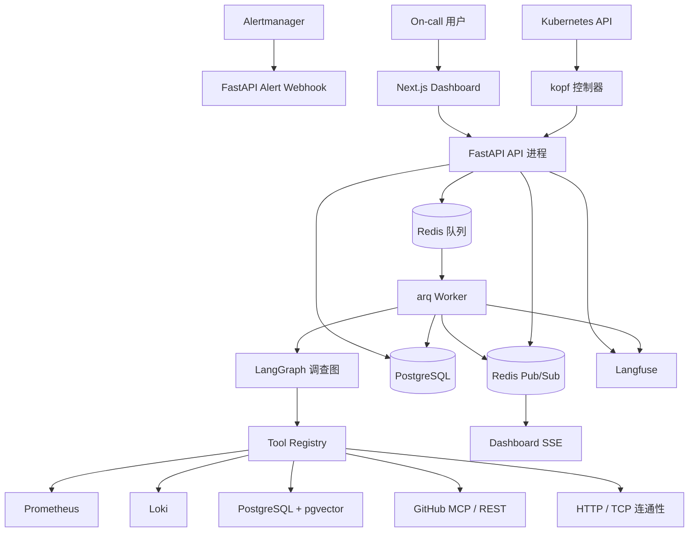
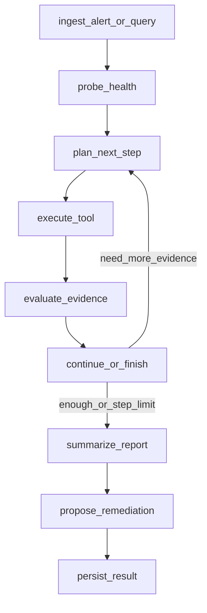

# OnCallPilot 设计规格

## 1. 产品目标

OnCallPilot 是一个**部署在 Kubernetes 上的云原生 on-call 智能调查平台**。它不是“只能诊断 Kubernetes 问题”的工具——它运行在 Kubernetes 上，服务对象是一般化的 on-call 工作流：告警接入、证据收集、根因分析、修复建议，以及可选的 GitHub Issue / PR 提案。

首发版本必须打通一条端到端闭环：

1. 接收 Alertmanager 告警或来自 HealthCheck CRD 的查询。
2. 创建 incident，并启动一次 investigation 会话。
3. 通过 LangGraph 调用真实的工具：指标（Prometheus）、日志（Loki）、运行手册检索（RAG）、事故记忆、GitHub、连通性检查。
4. 每一次工具调用都落审计记录。
5. 输出一份以证据为依据的报告与修复提案。
6. 通过 API 暴露调查结果，并由 Dashboard 提供可视化与人工干预入口。

OnCallPilot 是面向真实企业生产场景设计的产品。所有验证场景统一称为“参考场景（reference scenario）”，被监控应用统一称为“参考工作负载（reference workload）”，避免出现任何弱化产品定位的临时性表述。

## 2. 非目标

- 不自动改动生产环境资源。
- 首发版本不做多 agent 编排。
- 不假设被诊断系统就是 Kubernetes 工作负载。
- 首发版本不直接提交 GitHub PR（只提供 issue 创建 + PR 提案文本）。
- 不内建身份系统、不做多租户、不做超出控制器自身所需的 RBAC（OIDC / 完整鉴权由后续安全加固阶段独立交付）。
- **OnCallPilot 不打包基础设施**：Postgres（含 pgvector）、Redis、Prometheus、Loki、OpenAI 兼容 LLM endpoint 都由运营者自行准备并通过配置文件传入。

## 3. 架构概览

采用**模块化单体**（apps/api）+ **独立 Worker**（apps/worker）+ **独立 kopf 控制器**（apps/controller）+ **Next.js 前端**（apps/web）+ **参考工作负载**（samples/payment-api）的拆分。后端拥有 API、LangGraph 编排、持久化、工具适配器与审计；Worker 负责异步执行 investigation；控制器只 watch CRD 并调用后端 API；前端只调用后端 API。



### 3.1 进程拆分要点

- **apps/api**（FastAPI，单 replica 起步可水平扩展）：HTTP API、SSE 端点、把 investigation 任务推入 arq 队列、CRD 控制器 / 前端的对外接口。
- **apps/worker**（arq worker，单或多 replica）：从队列取任务执行 LangGraph，写入 DB 与 Redis 事件总线。
- **apps/controller**（kopf controller，**单 replica + Recreate 策略**）：watch 三种 CRD：`HealthCheck`、`ScheduledHealthCheck`、`ServiceCatalog`（首发版本三者并列），并调用后端 API。
- **apps/web**（Next.js App Router）：纯前端，仅消费后端 API + SSE。
- **samples/payment-api**（参考工作负载）：随仓库分发的样例上游服务，正常态运行，用于端到端验证；故障注入（chaos-mesh）作为独立阶段后置交付。

### 3.2 部署形态

**Helm Chart 是唯一交付形态**。`deploy/helm/oncallpilot/` 提供完整 chart：

- templates 渲染各 Deployment / Service / ConfigMap / Secret 引用 / CRD / RBAC / Ingress 注解
- `values.example.yaml` 给最小可运行配置
- `values.scenario.yaml` 给参考场景验证使用
- 不维护 `deploy/k8s/` 下的裸 manifests，以避免与 Helm 配置形成双轨

## 4. 仓库结构

```text
OnCallPilot/
  apps/
    api/                    # FastAPI 服务
      oncallpilot_api/
        main.py
        config.py           # YAML 加载 + env_ref 解析
        dependencies.py
        api/
          routes_alerts.py
          routes_incidents.py
          routes_investigations.py
          routes_chat.py
          routes_datasources.py
          routes_incident_memories.py
          routes_events.py  # SSE
        agent/
          state.py
          investigation_graph.py
          chat_graph.py
          prompts.py        # 英文 system prompt
          policies.py       # 步数策略 / 工具家族禁用
          report_schema.py
        tools/
          base.py
          registry.py
          prometheus.py
          loki.py
          connectivity.py
          runbook_rag.py
          incident_memory.py
          github.py
          github_mcp.py
        db/
          session.py
          models.py
          repositories.py
          migrations/       # Alembic
        services/
          investigation_service.py
          chat_service.py
          datasource_service.py
          remediation_service.py
          audit_service.py
          service_catalog.py
          event_bus.py      # Redis pub/sub 抽象
        observability/
          tracer.py         # Langfuse / NoOp / 预留 OTel
        i18n/
          prompts_zh.py     # 用户可见输出辅助
      tests/
        unit/
        integration/
      pyproject.toml
      Dockerfile

    worker/                 # arq worker
      oncallpilot_worker/
        main.py
        jobs.py             # investigation 任务入口
      pyproject.toml
      Dockerfile

    controller/             # kopf 控制器
      oncallpilot_controller/
        main.py
        handlers_healthcheck.py
        handlers_scheduled_healthcheck.py
        handlers_service_catalog.py
        client.py
        cron.py
      tests/unit/
      pyproject.toml
      Dockerfile

    web/                    # Next.js 前端
      app/
      components/
      lib/
      messages/
        zh-CN.json
        en.json             # 占位
      next.config.mjs
      package.json

  samples/
    payment-api/            # 参考工作负载（正常态）
      app/
      pyproject.toml
      Dockerfile
      README.md

  deploy/
    helm/
      oncallpilot/
        Chart.yaml
        values.yaml
        values.example.yaml
        values.scenario.yaml
        templates/
          api-deployment.yaml
          worker-deployment.yaml
          controller-deployment.yaml
          web-deployment.yaml
          services.yaml
          configmap.yaml
          rbac.yaml
          crds/             # 三个 CRD
          ingress.yaml
          migration-job.yaml
    scenarios/
      payment-api-high-error-rate/
        chaos-network.yaml  # Phase 14 才交付
        runbook.md

  config/
    oncallpilot.example.yaml

  docs/
    runbooks/
      high-error-rate.md
      db-connection-timeout.md
      high-latency.md
      deployment-regression.md
      payment-service-runbook.md
    scenarios/
      payment-api-high-error-rate/
        manual-trigger.md   # 手工触发流程
        validation.md       # 验收清单
    architecture/

  scripts/
    seed_runbooks.py
    seed_incident_memory.py
    run_scenario_payment_api_high_error_rate.py

  README.md
```

## 5. 配置规格

### 5.1 配置文件加载

OnCallPilot 通过单一 YAML 配置文件加载所有运行参数。路径由环境变量 `ONCALLPILOT_CONFIG` 指定，**未设置或文件不存在则进程 fail-fast 退出**，不引入内置缺省值。

加载机制：基于 `pydantic-settings` 自写一个 `YamlConfigSettingsSource`（约 50 行代码），不引入 `dynaconf` / `OmegaConf` 等高阶抽象。

敏感信息**禁止直接写入 YAML**。配置以 `*_env: VAR_NAME` 形式只声明对应环境变量名，加载时从 `os.environ` 解析；缺失即 fail-fast。

### 5.2 配置 Schema

```yaml
app:
  log_level: info
  api:
    host: 0.0.0.0
    port: 8080

datasources:
  postgres:
    url_env: POSTGRES_URL                # asyncpg DSN
  redis:
    url_env: REDIS_URL
  prometheus:
    url: http://prometheus.observability.svc:9090
  loki:
    url: http://loki.observability.svc:3100

llm:
  base_url: https://api.openai.com/v1    # OpenAI 协议兼容端点
  api_key_env: OPENAI_API_KEY
  model: gpt-4.1
  embedding_model: text-embedding-3-small
  embedding_dim: 1536                    # 与 pgvector 列维度一致；首次建表后不可改

github:
  api_base_url: https://api.github.com   # 也可指向 GHE
  token_env: GITHUB_TOKEN
  write_enabled: false                   # 仅 create_issue 受此开关保护
  default_repositories: []               # service_catalog 缺失时的兜底，可空

agent:
  max_tool_steps: 10                     # investigation 工作预算
  hard_step_cap: 20                      # 硬上限，超出直接 abort
  chat_max_tool_steps: 3                 # chat 短链预算
  tool_failure_disable_threshold: 3      # 同一工具家族连续失败 N 次后该家族禁用
  incident_memory:
    draft_threshold_confidence: 0.7      # 触发 draft 入库的最小 confidence
    include_drafts_in_search: false
  output_language_policy: zh             # zh | en | auto

worker:
  arq:
    queue: oncallpilot:jobs
    job_timeout_seconds: 600
    max_jobs: 10

observability:
  langfuse:
    enabled: false
    host_env: LANGFUSE_HOST
    public_key_env: LANGFUSE_PUBLIC_KEY
    secret_key_env: LANGFUSE_SECRET_KEY
  otel:
    enabled: false
    exporter_endpoint: ""

i18n:
  default_locale: zh-CN
  available_locales: [zh-CN]             # en 后续 Phase 启用

events:
  redis_channel_prefix: oncallpilot:events
  sse_history_replay: true               # SSE 接入时是否先回放历史事件
```

### 5.3 Helm values 与 ConfigMap 关系

Helm `templates/configmap.yaml` 把 `values.yaml` 的 `oncallpilotConfig` 段渲染为上述 YAML 内容，挂载到容器 `/etc/oncallpilot/config.yaml`。各容器以 `ONCALLPILOT_CONFIG=/etc/oncallpilot/config.yaml` 启动。**不允许任何字段以 env 覆盖 YAML 的方式存在**，避免出现“代码读 env、运维改 YAML”的脱节。

## 6. 后端 API

所有 API 前缀 `/api/v1`。首发版本无身份鉴权，但 Helm chart 允许在 Ingress 注解上挂 nginx basic auth 作为最低门槛。

### 6.1 告警与 Incident

- `POST /api/v1/alerts/alertmanager`：接收 Alertmanager webhook，返回 `{ incident_id, session_id, created: bool }`。**幂等键**为 alert 的 `fingerprint`（见 §7 状态机）。
- `GET /api/v1/incidents?limit=&status=&service=`：分页列表。
- `GET /api/v1/incidents/{id}`：详情，含关联 sessions 摘要。
- `POST /api/v1/incidents/{id}/close`：人工关闭，body `{ reason }`。
- `POST /api/v1/incidents/{id}/reopen`：人工重开，body `{ reason }`。
- `POST /api/v1/incidents/{id}/investigations`：触发再次调查，body 可选 `{ extra_context }`，返回新的 `session_id`。

### 6.2 Investigation

- `POST /api/v1/investigations`：手动创建一次 investigation（不绑定 incident，例如 CRD HealthCheck 走这条），body `{ query, mode: monitor|alert, context: {} }`，返回 `{ session_id }`。
- `GET /api/v1/investigations/{id}`：返回 session 状态、报告、工具调用、证据、修复提案。
- `GET /api/v1/investigations/{id}/events`：**SSE 流**，文本类型 `text/event-stream`，事件类型见 §11。

### 6.3 Chat

- `POST /api/v1/chat/sessions`：创建新会话，返回 `{ session_id }`。
- `GET /api/v1/chat/sessions?limit=`：最近会话列表。
- `GET /api/v1/chat/sessions/{id}`：会话元数据。
- `POST /api/v1/chat/sessions/{id}/messages`：追加用户消息并触发响应（**同步**返回最终消息；同时事件流可订阅）。
- `GET /api/v1/chat/sessions/{id}/messages`：列消息历史。
- `GET /api/v1/chat/sessions/{id}/events`：SSE 流，事件结构与 investigation 通用。

### 6.4 数据源

- `GET /api/v1/datasources/status`：返回各数据源最近一次健康检查结果。
- `POST /api/v1/datasources/check`：触发一次主动健康检查刷新。

### 6.5 Incident Memory 审阅

- `GET /api/v1/incident-memories?status=&service=`：列表。
- `GET /api/v1/incident-memories/{id}`：详情。
- `POST /api/v1/incident-memories/{id}/review`：body `{ action: verify|reject, notes? }`。

### 6.6 Service Catalog

Service Catalog 在首发版本以 **CRD 为权威源**（见 §13）。后端只提供只读 API：

- `GET /api/v1/service-catalog`：当前注册的服务列表。
- `GET /api/v1/service-catalog/{service}`：单条详情。

写入由 `kubectl apply ServiceCatalog` 完成，控制器 watch 后同步到 DB（也作为后端运行时唯一数据源）。

### 6.7 健康端点

- `/healthz`：liveness，简单存活。
- `/readyz`：readiness，检查 DB / Redis / LLM endpoint 可达性。

### 6.8 Alertmanager Payload 解析约定

需稳定提取：`alertname`、`service`（标签 `service` 必填）、`severity`、`summary`、`description`、`startsAt`、`status`（firing|resolved）、`fingerprint`、完整 `labels` / `annotations`。

## 7. 数据模型

采用 SQLAlchemy 2.x async + Alembic + PostgreSQL + pgvector。所有时间戳统一 UTC。

### 7.1 `datasource_status`

```
id UUID PRIMARY KEY
name TEXT NOT NULL
type TEXT NOT NULL                   -- prometheus|loki|postgres|redis|llm|github
status TEXT NOT NULL                 -- ok|degraded|down
last_checked_at TIMESTAMPTZ
latency_ms INTEGER
message TEXT
```

### 7.2 `incidents`

```
id UUID PRIMARY KEY
alert_fingerprint TEXT NOT NULL
alertname TEXT NOT NULL
service TEXT NOT NULL
severity TEXT NOT NULL
summary TEXT
description TEXT
status TEXT NOT NULL                 -- open|investigating|resolved|error
source TEXT NOT NULL                 -- alertmanager|healthcheck|manual
started_at TIMESTAMPTZ NOT NULL
last_seen_at TIMESTAMPTZ NOT NULL
resolved_at TIMESTAMPTZ
closed_at TIMESTAMPTZ
closed_reason TEXT
reopen_count INTEGER NOT NULL DEFAULT 0
labels JSONB NOT NULL DEFAULT '{}'
annotations JSONB NOT NULL DEFAULT '{}'
created_at TIMESTAMPTZ NOT NULL
updated_at TIMESTAMPTZ NOT NULL

UNIQUE INDEX ON (alert_fingerprint) WHERE status IN ('open','investigating')
INDEX ON (service, started_at DESC)
```

### 7.3 `investigation_sessions`

```
id UUID PRIMARY KEY
incident_id UUID NULL REFERENCES incidents(id)
source TEXT NOT NULL                 -- alert|healthcheck|manual|reinvestigate
query TEXT
status TEXT NOT NULL                 -- pending|running|completed|failed
final_report JSONB                   -- 见 §10
verdict TEXT                         -- healthy|unhealthy|inconclusive
verdict_reason TEXT
confidence NUMERIC
step_count INTEGER NOT NULL DEFAULT 0
terminated_reason TEXT               -- finished|hard_cap|tool_exhausted|error
started_at TIMESTAMPTZ NOT NULL
completed_at TIMESTAMPTZ
```

### 7.4 `chat_sessions` / `chat_messages`

```
chat_sessions
  id UUID PRIMARY KEY
  title TEXT                         -- LLM 自动概括（首条消息后填）
  status TEXT NOT NULL               -- active|closed
  created_at TIMESTAMPTZ NOT NULL
  last_active_at TIMESTAMPTZ NOT NULL

chat_messages
  id UUID PRIMARY KEY
  session_id UUID NOT NULL REFERENCES chat_sessions(id)
  role TEXT NOT NULL                 -- user|assistant|tool
  content TEXT NOT NULL
  tool_call_id UUID NULL             -- 指向 tool_calls.id
  evidence JSONB                     -- 可选，assistant 消息的证据片段
  created_at TIMESTAMPTZ NOT NULL
```

### 7.5 `tool_calls`

```
id UUID PRIMARY KEY
investigation_session_id UUID NULL REFERENCES investigation_sessions(id)
chat_session_id UUID NULL REFERENCES chat_sessions(id)
tool_name TEXT NOT NULL
parameters JSONB NOT NULL
result_summary TEXT
result_data JSONB                    -- ToolResult.data 的结构化部分
raw_output_ref TEXT                  -- 首发版本一律 NULL，预留接对象存储
status TEXT NOT NULL                 -- success|error
latency_ms INTEGER
error_message TEXT
step_index INTEGER                   -- 在 graph 中的步号
created_at TIMESTAMPTZ NOT NULL

CHECK (
  (investigation_session_id IS NOT NULL)::int +
  (chat_session_id IS NOT NULL)::int = 1
)
INDEX ON (investigation_session_id, step_index)
INDEX ON (chat_session_id, created_at)
```

### 7.6 `runbook_documents`

首发版本只建非向量字段。**向量列在 RAG Phase 通过独立 migration 增加**。

```
id UUID PRIMARY KEY
runbook_id TEXT NOT NULL UNIQUE      -- 取自 frontmatter
title TEXT NOT NULL
path TEXT NOT NULL
services TEXT[] NOT NULL DEFAULT '{}'
alertnames TEXT[] NOT NULL DEFAULT '{}'
tier TEXT
owner_team TEXT
language TEXT NOT NULL DEFAULT 'zh'
content TEXT NOT NULL                -- 完整 markdown
sections JSONB NOT NULL              -- {section_name: section_text}
frontmatter JSONB NOT NULL
created_at TIMESTAMPTZ NOT NULL
updated_at TIMESTAMPTZ NOT NULL
```

### 7.7 `runbook_chunks`（RAG 切分单元，在 RAG Phase 与 embedding 列同期加入）

```
id UUID PRIMARY KEY
runbook_id TEXT NOT NULL REFERENCES runbook_documents(runbook_id)
section TEXT NOT NULL                -- "Symptoms" / "Common Causes" ...
chunk_index INTEGER NOT NULL
text TEXT NOT NULL
embedding VECTOR(<EMBEDDING_DIM>)
created_at TIMESTAMPTZ NOT NULL
```

### 7.8 `incident_memories`（RAG Phase 同期加 embedding）

```
id UUID PRIMARY KEY
service TEXT NOT NULL
alertname TEXT
symptoms TEXT NOT NULL
root_cause TEXT NOT NULL
resolution TEXT NOT NULL
linked_issue_or_pr TEXT
dedup_key TEXT NOT NULL              -- hash(service + alertname + normalize(root_cause))
status TEXT NOT NULL DEFAULT 'draft' -- draft|verified|rejected
source_session UUID NULL REFERENCES investigation_sessions(id)
reviewed_by TEXT
reviewed_at TIMESTAMPTZ
review_notes TEXT
embedding VECTOR(<EMBEDDING_DIM>)
created_at TIMESTAMPTZ NOT NULL
updated_at TIMESTAMPTZ NOT NULL

UNIQUE INDEX ON (dedup_key) WHERE status IN ('draft','verified')
```

### 7.9 `remediation_actions`

```
id UUID PRIMARY KEY
investigation_session_id UUID NOT NULL REFERENCES investigation_sessions(id)
type TEXT NOT NULL                   -- github_issue|pr_proposal|manual_action
title TEXT NOT NULL
description TEXT NOT NULL
url TEXT
diff TEXT
status TEXT NOT NULL                 -- proposed|created|skipped|failed
metadata JSONB NOT NULL DEFAULT '{}'
created_at TIMESTAMPTZ NOT NULL
```

### 7.10 `service_catalog`（CRD 同步表）

```
service TEXT PRIMARY KEY
tier TEXT
owner_team TEXT
github_owner TEXT
github_repo TEXT
runbook_ids TEXT[] NOT NULL DEFAULT '{}'
prometheus_label TEXT NOT NULL DEFAULT 'service'
loki_label TEXT NOT NULL DEFAULT 'service'
spec_version INTEGER NOT NULL
synced_at TIMESTAMPTZ NOT NULL
```

### 7.11 数据保留

首发版本不做自动清理。`tool_calls` / `chat_messages` / `investigation_sessions` 仅靠人工或后续运营加固阶段引入的清理 Job 处理。该项作为 deferred operational hardening 项明确列出。

## 8. 状态机与幂等

### 8.1 Alertmanager Webhook 幂等

- 以 `alert.fingerprint` 为幂等键。
- 同一 fingerprint 当前已有 `open / investigating` incident → 不再创建，返回已有 `incident_id`，`created=false`，**不**触发新 investigation；只刷新 `last_seen_at`。
- 同一 fingerprint 仅存在 `resolved` incident → 视为新一轮事件，创建新 incident（保留独立 timeline）。
- payload `status=resolved` → 找到当前 open/investigating incident 置为 `resolved`，写 `resolved_at` 与 `closed_reason='alertmanager: resolved'`，不触发 investigation。
- arq 入队 job_id 用 `investigation:{session_id}`，session_id 自然唯一；fingerprint 幂等在 incident 层挡掉，arq 层不需额外去重。

### 8.2 Incident 状态机

```
            +----------------- close ------------------+
            |                                          v
   open --> investigating --> resolved (auto/manual) --+--> reopen ---> open
                                                          |
                              re-investigate (新 session) |
                              (不改 incident 状态) --------+
```

`investigation_sessions` 与 `incidents` 一对多。同一 incident 多次 re-investigate 会产生多条 session，timeline 顺序展示。

## 9. Tool Layer

所有工具实现统一接口：

```python
class ToolResult(BaseModel):
    tool_name: str
    status: Literal["success", "error"]
    summary: str                              # 必填，≤ 280 字符
    data: dict | list | str | None = None     # 工具自定义 typed Pydantic 序列化
    raw_output_ref: str | None = None         # 首发版本一律 None
    latency_ms: int
    error_message: str | None = None
```

工具调用强制审计：`audit_service.record_tool_call` 在工具执行前 / 后落 `tool_calls` 行（含 step_index、session_id、参数、ToolResult）。任何工具异常都转译为 `status=error` + `error_message` 入库，**不**让异常穿透到 graph 控制流。

### 9.1 Prometheus 工具

- `check_prometheus_health`
- `query_prometheus(promql, time, lookback)`
- `get_service_error_rate(service, window)`
- `get_service_latency(service, window, quantile=0.95)`
- `get_service_qps(service, window)`
- `get_service_cpu_memory(service, window)`

PromQL 模板按 service 的 `prometheus_label`（来自 service_catalog）拼接，默认 `service="<name>"`。

### 9.2 Loki 工具

- `check_loki_health`
- `query_logs_by_service(service, window, limit)`
- `query_error_logs(service, window, limit)`
- `query_logs_around_time(service, ts, before, after, limit)`
- `summarize_log_patterns(service, window)`：调用 LLM 对日志做模式聚类的辅助工具，返回 top N 模式

### 9.3 Runbook RAG 工具

- `search_runbook(query, top_k=5, services=None, alertnames=None)`：基于 `runbook_chunks` 向量检索；若提供 services/alertnames，对 service_catalog 命中的 runbook 加权（boost）。

### 9.4 Incident Memory 工具

- `search_incident_memory(query, top_k=3)`：默认仅召回 `status=verified`；若配置 `include_drafts_in_search=true`，召回 verified+draft，draft 命中时返回结果带 `confidence_penalty=0.5` 标记。
- `save_incident_memory(memory)`：以 `draft` 写入。

### 9.5 GitHub 工具

适配器 `tools/github.py`（REST）与 `tools/github_mcp.py`（MCP）实现同一组方法：

- `search_recent_commits(service, since)`
- `search_pull_requests(service, since)`
- `create_issue(service, title, body, labels)`：受 `github.write_enabled=true` 保护；未启用时直接抛 `GitHubWriteDisabledError`，由 remediation_service 转 `pr_proposal` / `manual_action` 落地。

GitHub 仓库归属来自 service_catalog 表（`github_owner/github_repo`），找不到时工具返回 `status=error, error_message="service '<x>' not registered in catalog"`。

### 9.6 Connectivity 工具

- `check_http_endpoint(url, timeout)`
- `check_tcp_port(host, port, timeout)`

### 9.7 工具家族禁用与端点缺失

启动时如果某数据源 URL 未配置（如 `loki.url` 为空），对应工具家族不注册。首发版本如此处理。

运行时同一家族**连续 3 次** error → 在当前 session 内禁用该家族（阈值由 `agent.tool_failure_disable_threshold` 控制），剩余步数 LLM 不再看到此组工具。

## 10. LangGraph 调查图

### 10.1 Investigation Graph



State 字段：

```
input_type: alert | query | healthcheck
incident_id, session_id
query, alert_context
step_index, max_tool_steps, hard_step_cap
tools_enabled                          # 当前可用工具家族
plan                                   # LLM 当前规划
selected_tool, tool_args
evidence: list[EvidenceItem]
tool_calls: list[ToolCallRecord]
errors
report: FinalReport | None
remediation
verdict, verdict_reason, confidence
language                               # 输出语言
```

### 10.2 节点行为规则

- **probe_health**：固定第 1 步，并发跑各数据源健康检查。任一关键数据源不可用 → 跳过 Plan/Execute 直接 Summarize，verdict=`inconclusive`，verdict_reason 写明哪个数据源缺失。
- **plan_next_step**：把 alert/query + evidence summary + 当前可用工具及参数 schema 喂给 LLM（OpenAI function calling），LLM 返回 `selected_tool` + `tool_args` 或 `finish` 信号。Prompt 强制要求附 ≤30 字 reasoning（落入 evidence trace）。
- **三条护栏**：
  1. 同一 `(tool_name, hash(args))` 在一次 session 内只执行一次，重复请求直接跳过并在 plan 提示 LLM “已调过”；
  2. 工具家族连续失败阈值见 §9.7；
  3. LLM 连续 2 次返回 finish → 真的进入 Summarize。
- **execute_tool**：调用 registry，测延迟，错误转 `ToolResult(status=error)`，强制 audit。
- **evaluate_evidence**：把 `ToolResult` 落入 `evidence` 列表（结构见 §10.3），区分类型 `metric|log|runbook|memory|github|connectivity|signal_missing`。
- **continue_or_finish**：触发条件：达到 `max_tool_steps`、连续 finish、关键证据链已闭合（至少一条 metric/log + 一条 runbook 或 memory）。
- **summarize_report**：tools 禁用，强制由 LLM 产出 FinalReport JSON。
- **propose_remediation**：依据 verdict + confidence + github.write_enabled 决定 issue / pr_proposal / manual_action。
- **persist_result**：写 session.final_report / verdict 等；满足 §11.3 条件时把 draft 入 `incident_memories`。

### 10.3 步数预算

- `MAX_TOOL_STEPS = 10`（默认，可配）。
- `HARD_STEP_CAP = 20`（默认，可配）：超过则直接 abort，`terminated_reason='hard_cap'`，仍尝试以现有 evidence 生成最简 report（`verdict='inconclusive', confidence=0`）。
- 倒数第 1 步（`step_index == MAX_TOOL_STEPS - 1`）强制 tools 禁用并进入 Summarize。

### 10.4 Final Report Schema

```json
{
  "summary": "string",
  "verdict": "healthy | unhealthy | inconclusive",
  "verdict_reason": "string (≤140 chars)",
  "confidence": 0.0,
  "suspected_root_cause": "string",
  "impact": "string",
  "evidence": [
    {
      "type": "metric|log|runbook|memory|github|connectivity|signal_missing",
      "summary": "string",
      "source": "string",
      "confidence": 0.0
    }
  ],
  "recommended_actions": ["string"],
  "related_runbook": [{"runbook_id": "string", "title": "string"}],
  "related_historical_incidents": [{"id": "string", "summary": "string"}],
  "remediation_proposal": {
    "type": "github_issue | pr_proposal | manual_action",
    "title": "string",
    "description": "string",
    "url": "string | null",
    "diff": "string | null"
  }
}
```

### 10.5 Chat Graph

`agent/chat_graph.py` 共享同一 registry / LLM client / audit_service / tracer / event_bus，差异点：

- 多轮：把 `chat_messages` 历史作为上下文喂给 LLM。
- 短链：`chat_max_tool_steps = 3` 默认。
- 输出 markdown 而非 FinalReport；evidence 可选附在 message 上。
- 同步执行（不入 arq 队列），但 tool 调用仍 audit + 通过 event_bus 推 SSE。
- 不产生 verdict、不写 incident_memory。
- LLM 判定“此查询像一次事故”可在响应里附 `suggest_upgrade_to_investigation: true`，前端据此展示按钮，触发 `POST /api/v1/investigations`。

### 10.6 Incident Memory 写入触发

`persist_result` 节点中，同时满足以下条件即写入 `incident_memories` `status=draft`：

- `verdict == 'unhealthy'`
- `confidence >= agent.incident_memory.draft_threshold_confidence`
- `suspected_root_cause` 非空字符串

按 `dedup_key = sha256(service|alertname|normalize(root_cause))` 去重：已有 `verified` 行 → 不写；已有 `draft` 行 → 覆盖（保留最新 evidence）。

## 11. 实时事件总线

### 11.1 抽象

`services/event_bus.py` 提供：

```python
class EventBus(Protocol):
    async def publish(self, channel: str, event: dict) -> None: ...
    def subscribe(self, channel: str, last_event_id: str | None) -> AsyncIterator[dict]: ...
```

首发实现 `RedisPubSubEventBus`，复用 arq 已依赖的 Redis 实例。

### 11.2 事件类型

`channel = f"{events.redis_channel_prefix}:investigation:{session_id}"`（chat 同理）。事件 payload：

```
session.started        { session_id, started_at }
step.planned           { step_index, planned_tool, planned_args, reasoning }
tool.started           { step_index, tool_name, args_summary }
tool.completed         { step_index, tool_name, status, summary, latency_ms }
evidence.added         { type, summary, source, confidence }
session.completed      { session_id, verdict, confidence, report_id }
session.failed         { session_id, terminated_reason, error_message }
```

### 11.3 SSE 行为

- 客户端 connect → 服务端先从 DB 一次性回放历史 `tool_calls` + 已落地 `evidence` 为对应事件流（保证刷新页面不丢线），随后切换 Redis 实时订阅。
- 支持 `Last-Event-ID` header：服务端只回放该 ID 之后的事件。
- session 已完成时：推送全量历史后立即 close。
- 不引入轮询 fallback，不引入 WebSocket。
- Ingress 必需注解（Helm chart 默认提供）：`nginx.ingress.kubernetes.io/proxy-buffering: "off"`、`nginx.ingress.kubernetes.io/proxy-read-timeout: "3600"`。

## 12. Observability

### 12.1 Tracer 抽象

`observability/tracer.py`：

```python
class Tracer(Protocol):
    def start_session(self, session_id: str, attrs: dict) -> None: ...
    def start_step(self, name: str, attrs: dict) -> None: ...
    def record_llm(self, model: str, prompt: str, completion: str, usage: dict) -> None: ...
    def record_tool(self, tool: str, args: dict, result_summary: str, latency_ms: int, error: str | None) -> None: ...
    def end_session(self, status: str, attrs: dict) -> None: ...
```

实现：

- `NoOpTracer`：默认。
- `LangfuseTracer`：当 `observability.langfuse.enabled=true` 且 env 全配置时启用。
- `CompositeTracer`：未来引入 `OtelTracer` 时启用。

Langfuse trace 与 `investigation_sessions.id` / `chat_sessions.id` 双向关联，方便从 Dashboard 跳到 Langfuse 看完整 prompt/usage。

### 12.2 DB 审计与 Tracer 的职责划分

- DB（`tool_calls` 等）：业务可审计、产品 surface 数据源、永远存在。
- Langfuse trace：开发与运维诊断、可关闭、不参与产品逻辑。
- Dashboard 不复制 Langfuse 的 trace 视图，只展示 DB 中的业务数据。

### 12.3 日志

全 stdout 输出结构化 JSON（`structlog`），关键字段：`ts`、`level`、`service`、`event`、`incident_id`、`session_id`、`step_index`、`tool`、`latency_ms`。

## 13. CRD

### 13.1 ServiceCatalog

```yaml
apiVersion: oncallpilot.io/v1alpha1
kind: ServiceCatalog
metadata:
  name: payment-api
spec:
  service: payment-api
  tier: critical
  ownerTeam: payments
  github:
    owner: acme
    repo: payment-api
  runbookIds:
    - payment-service-runbook
    - db-connection-timeout
  labels:
    prometheus: service        # 默认 "service"，可覆盖
    loki: service
```

控制器 watch ServiceCatalog → 调后端 `PUT /api/v1/service-catalog/sync`（内部接口，仅控制器可达）→ 后端 upsert 到 `service_catalog` 表，`spec_version` 自增。

### 13.2 HealthCheck

```yaml
apiVersion: oncallpilot.io/v1alpha1
kind: HealthCheck
metadata:
  name: payment-api-health
spec:
  query: "payment-api 当前是否健康？"
  service: payment-api          # 可选；用于 service_catalog 关联
  datasources: []               # 可选；空表示用全部已注册
  timeout: 300
  mode: monitor                 # monitor | alert
status:
  phase: Pending|Running|Completed|Failed
  verdict: healthy|unhealthy|inconclusive
  result: pass|fail|error
  message: string
  rationale: string
  sessionId: string
  startedAt, completedAt
```

控制器行为：

1. 创建 HealthCheck → patch `status.phase=Running`、`startedAt=now`。
2. 调 `POST /api/v1/investigations`，body `{ query, source: 'healthcheck', context: { healthcheck_name, namespace, service } }`，获 session_id。
3. 在 `spec.timeout` 内轮询 `GET /api/v1/investigations/{id}`。
4. 完成后：
   - 报告 `verdict=healthy` → `status.result=pass`
   - `verdict=unhealthy` → `status.result=fail`
   - `verdict=inconclusive` 或超时/失败 → `status.result=error`
5. `mode: alert` 且 `result=fail` → 控制器额外调 `POST /api/v1/alerts/alertmanager` 提交一份合成告警 payload（labels: `alertname=HealthCheckFailed`, `service=<spec.service>`, `severity=warning`），自闭环到 incident 流。

### 13.3 ScheduledHealthCheck

```yaml
apiVersion: oncallpilot.io/v1alpha1
kind: ScheduledHealthCheck
metadata:
  name: payment-api-hourly
spec:
  schedule: "0 * * * *"
  query: "payment-api 当前是否健康？"
  service: payment-api
  enabled: true
  timeout: 300
  mode: monitor
status:
  lastScheduleTime
  lastResult
  message
  history: [{ scheduledAt, completedAt, result, message, sessionId, healthCheckRef }] # 最多保留 10 条
```

控制器行为：

- 单 replica + Recreate 策略。
- `@kopf.timer(interval=30, idle=30)` 周期扫所有 ScheduledHealthCheck。
- 用 `croniter` + `status.lastScheduleTime` 判断本次是否触发。
- 触发：创建子 `HealthCheck`（owner reference 指向自己），由 HealthCheck handler 接力。
- 若距 `lastScheduleTime < spec.timeout`，跳过本次并把原因写 `status.message`。
- 历史保留 10 条，环形覆盖。

### 13.4 RBAC

控制器 ServiceAccount 最小权限：

- `oncallpilot.io/*` 全部 CRD：CRUD + status update
- `events`：create
- 无其它 Kubernetes API 权限。

## 14. 前端 Dashboard

Next.js App Router + `next-intl`（默认 `zh-CN`）+ React Query + Tailwind。**所有可见字符串走字典 key**，不硬编码，保证多语言后续无需重写。

页面：

- `/`：首页。最近 incident、数据源健康、最近 ScheduledHealthCheck 状态。
- `/incidents`：列表 + 过滤。
- `/incidents/[id]`：详情。告警 payload、关联 sessions、close/reopen/re-investigate 按钮（带 confirm dialog 收集 reason）。
- `/investigations/[id]`：调查详情。SSE 时间线、证据链、final report、修复提案、跳 Langfuse 按钮（如启用）。
- `/chat`：会话列表 + 多轮聊天界面。每条 assistant 消息可展开证据片段；有 `suggest_upgrade_to_investigation` 提示时显示按钮。
- `/incident-memories`：列表 + 详情 + Verify/Reject/Edit。
- `/service-catalog`：只读列表（CRD 为权威源）。

## 15. 参考工作负载 `samples/payment-api`

随仓库分发的样例服务。**首发版本只实现正常态**：

- FastAPI 应用，依赖独立 Postgres。
- 路由提供典型的支付 API mock（创建订单、查询订单），全部 200 路径。
- 暴露 `/metrics`（prometheus_client），核心指标：
  - `http_requests_total{service="payment-api", method, status}`
  - `http_request_duration_seconds{service="payment-api"}` (Histogram)
  - `db_connections_in_use{service="payment-api"}`
  - `db_connection_errors_total{service="payment-api"}`
- 结构化 JSON 日志到 stdout，由集群日志栈（约定 promtail / grafana-agent）抓到 Loki，标签包含 `service="payment-api"`。
- README 明确："Reference workload distributed with OnCallPilot to validate end-to-end investigation pipelines. Production-grade fault injection (chaos-mesh) is delivered in Phase 14."

**故障路径不在 samples/payment-api 中内置**。Phase 13 端到端验证阶段，通过手工 K8s 操作（如 `kubectl scale postgres --replicas=0`）触发故障，让 payment-api 自然抛出 DB 超时；Phase 14 才用 chaos-mesh 把这一过程声明化。

## 16. 参考场景：payment-api HighErrorRate

### 16.1 期望链路

1. payment-api 正常态运行 ≥ 5 分钟（足够 Prometheus 5m rate 窗口）。
2. 通过 Phase 13 文档化的手工命令使 payment-api 与其 Postgres 之间出现连接故障 → `db_connection_errors_total` 增长，日志出现 `DB_CONN_TIMEOUT`，HTTP 5xx 率上升。
3. Alertmanager 基于配置规则触发 `HighErrorRate{service=payment-api}` 告警。
4. `POST /api/v1/alerts/alertmanager` 接收 → 新建 incident → arq 入队 → worker 跑 LangGraph：
   - probe_health：所有数据源 OK；
   - get_service_error_rate / get_service_latency：发现 5xx 升高；
   - query_error_logs / query_logs_around_time：发现 `DB_CONN_TIMEOUT`；
   - search_runbook：召回 `payment-service-runbook` + `db-connection-timeout`；
   - search_incident_memory：召回历史一条 verified 记忆（由 seed 脚本预灌）；
   - search_recent_commits / search_pull_requests：查最近改动；
5. summarize_report：verdict=`unhealthy`、confidence ≥ 0.7、suspected_root_cause = "DB 连接超时"。
6. propose_remediation：若 `github.write_enabled=true` → 创建 issue 并落 url；否则落 `pr_proposal` / `manual_action`。
7. persist_result：写 final_report、verdict、draft incident_memory。
8. Dashboard SSE 全程展示时间线。

### 16.2 验收清单（Phase 13）

- 一条 incident 创建，状态正确流转。
- 至少 1 条 metric evidence。
- 至少 1 条 log evidence 包含 `DB_CONN_TIMEOUT`。
- 至少 1 条 runbook evidence 命中 `payment-service-runbook`。
- 至少 1 条 memory evidence。
- final_report 含 verdict / confidence / suspected_root_cause / impact / recommended_actions。
- remediation_actions 一行落盘。
- SSE 时间线在 dashboard 中完整呈现。
- Langfuse 启用时可看到完整 trace。

## 17. 安全与运维

- 工具默认只读，`create_issue` 为唯一受 `github.write_enabled` 保护的写操作。
- 不在产品代码中默认任何变更性操作。
- 所有 tool 调用强制审计。
- 敏感凭据（数据库密码、LLM key、GitHub token）只通过环境变量 / Kubernetes Secret 注入，不进 YAML、不进日志（structlog 全局过滤敏感字段）。
- Secret 管理首发用 Kubernetes 原生 Secret，Helm `values.yaml` 提供 `existingSecret` 引用字段；External Secrets Operator / Vault 在后续 Phase 引入。
- RBAC：控制器最小权限（见 §13.4），API/worker 不获取 K8s API 权限。
- 健康端点 `/readyz` 检查依赖可达性，作为 readiness probe；`/healthz` 仅作 liveness。
- Web 前端在 MVP 内不强制鉴权，但 Helm chart 允许在 Ingress 上挂 nginx basic auth；OIDC 等正式身份方案在独立 Security Hardening Phase 引入。
- 不引入软删除：所有“删除”语义改为状态字段（`closed/rejected/resolved`）。

## 18. 测试策略

不在仓库内打包基础设施。测试分两层：

- **单元测试** (`tests/unit/`)：纯函数与边界逻辑；HTTP 客户端边界用 `respx` 等工具进行 unit 范围 mock；秒级反馈；CI 与本地默认运行。
- **集成测试** (`tests/integration/`)：直连真实基础设施（Postgres+pgvector / Redis / Prometheus / Loki / 真实 OpenAI 兼容端点）。从配置文件（`ONCALLPILOT_CONFIG`）读 endpoint。环境变量 `INTEGRATION_TESTS=1` 启用；若关键依赖未配置，整个套件 `skip` 并明确打印缺失项，不引入假 fixture。

所有外部交互通过适配器层抽象，便于在 unit test 中替换为 stub。

## 19. 国际化

- 默认 locale：`zh-CN`。`available_locales: [zh-CN]`，`en` 占位但首发不交付。
- Dashboard 全部 UI 字符串走 next-intl 字典，不硬编码。
- 内置 5 篇 runbook 以中文编写。
- System prompts 全部英文（与界面语言无关，保证 LLM instruction following 稳定性）。
- LLM 用户可见输出语言由 `agent.output_language_policy` 控制，默认 `zh`；`auto` 时随用户/告警最近语言自适应。
- Embedding 模型选支持多语言的 `text-embedding-3-small`，runbook / memory 不区分语言入索引。

## 20. Runbook 文档契约

### 20.1 Frontmatter（必填字段）

```yaml
---
id: payment-service-runbook
title: 支付服务 On-Call Runbook
services: [payment-api]
alertnames: [HighErrorRate, HighLatency]
tier: critical
related_runbooks: [db-connection-timeout, high-error-rate]
owner_team: payments
version: 1
language: zh
---
```

### 20.2 章节结构（必须按序出现）

1. `## Symptoms`
2. `## Common Causes`
3. `## Prometheus Queries`
4. `## Loki Queries`
5. `## Immediate Mitigation`
6. `## Long-term Remediation`
7. `## Escalation`

### 20.3 校验与切分

- `scripts/seed_runbooks.py` 加载时严格校验 frontmatter 全字段 + 章节齐全；任何不合规直接 fail-fast，避免破坏向量索引。
- 入库后按章节切 chunk，`runbook_chunks` 表保留 `(runbook_id, section, chunk_index)`，召回时可精准引用 `payment-service-runbook#Common Causes`。
- Service catalog 的 `runbook_ids` 用 frontmatter 中的 `id`（稳定 key），不引用 path。

## 21. 部署

### 21.1 Helm Chart

`deploy/helm/oncallpilot/`：

- 渲染：4 Deployment（api / worker / controller / web）、Services、ConfigMap、Secret 引用、3 个 CRD（ServiceCatalog / HealthCheck / ScheduledHealthCheck）、ServiceAccount + RBAC、Ingress、`migration-job.yaml`（Helm hook `pre-install,pre-upgrade`，执行 `alembic upgrade head`）。
- `values.example.yaml` 给最小可运行配置（无 Langfuse、无 GitHub 写、basic auth 关闭）。
- `values.scenario.yaml` 给 payment-api 参考场景验证用（启用 service_catalog、指向预置 Prom/Loki/GitHub）。
- Helm template 不引入除官方 chart-utils 之外的依赖。

### 21.2 镜像

每个 app 独立 Dockerfile，multi-stage（builder + runtime），用 `uv sync --frozen` 装依赖，非 root 用户运行，base image 选择 `python:3.12-slim`。Web 端用 `node:20-alpine` + `pnpm`。

### 21.3 端点出网

OnCallPilot 不假设互联网可达：

- LLM endpoint、GitHub endpoint、Prom/Loki 地址全部走配置，运营者可指向集群内私有部署（vLLM、GHE、私有 Prom）。
- endpoint 不可达 → 对应工具家族在启动期或运行期降级，graph 不崩溃。

## 22. 包管理与目录约定

- Python：全栈 `uv`，每个 app 独立 `pyproject.toml`，根目录用 `uv.lock` 统一锁定。
- Node：`pnpm` workspace（仅 `apps/web` 一个 workspace）。
- 不引入 Nx / Turborepo。顶层 `Makefile` 提供 `make api / worker / controller / web / lint / test` 任务。

## 23. 首发版本范围

### 23.1 必做

- API / Worker / Controller / Web / Sample workload 五个组件骨架与最小可运行。
- Postgres schema + Alembic migrations（首批不含向量列）。
- 配置文件加载与 fail-fast。
- Tool Layer（Prom / Loki / Connectivity + 通用接口与审计）。
- Alertmanager webhook + incident / investigation API + fingerprint 幂等。
- arq Worker + Redis 队列 + event_bus 实时事件。
- RAG（向量列 migration、embedding 客户端、runbook 与 incident_memory 工具）。
- LangGraph 调查图（含 chat graph）+ verdict + Langfuse Tracer。
- GitHub 工具（REST + 可选 MCP）+ remediation_service。
- 三个 CRD + kopf 控制器 + ServiceCatalog 同步。
- Helm Chart + migration Job。
- Dashboard 6 个页面 + SSE。
- 参考工作负载 `samples/payment-api`（正常态）。
- Phase 13 端到端验证文档与脚本。

### 23.2 推迟

- chaos-mesh 故障注入自动化（Phase 14）。
- 多 replica controller + kopf peering。
- 完整 ITSM（assignee / merge / postmortem / comments + author）。
- OIDC / mTLS 等正式身份方案。
- 数据自动清理 / 归档。
- 多 agent 编排。
- 自动 PR diff 生成。
- 对象存储承载 raw tool output。
- 英文 dashboard 与 runbook 全套。

## 24. 一致性自审

- 产品语义一致：全文以“参考场景 / 参考工作负载”表达验证用例，不出现弱化产品定位的临时性表述。
- 配置一致：`§5` 的 YAML schema 与 `§4` 的目录、`§21` 的 Helm chart、`§13` 的 CRD 字段、`§20` 的 runbook frontmatter 字段相互对齐。
- 数据模型一致：`§7` 中的字段被 `§6` 的 API、`§10` 的 graph、`§13` 的 CRD 控制器闭环使用。
- 推迟项明确：每一项推迟都给出收敛触发条件或后续 Phase。
- 抽象克制：仅 `Tracer` / `EventBus` / `ServiceCatalogRepository` 三个接口属于“为未来留口子”，每个都给出明确启用条件，符合“不引入无明确价值的双轨”。
